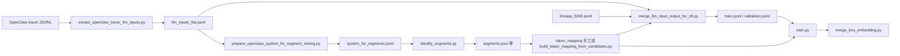

# LAR 思路迁移到 OpenClaw：说明与代码改动汇总

本文说明如何把 **LatentMemory / LAR** 的「重复性长 prompt → special token → 双视角 SFT + 可选 KL 蒸馏」管线接到 **OpenClaw** 真实 Agent 场景（以 TriviaQA + OpenClaw system prompt 为主），并列出本仓库中与该迁移相关的 **全部脚本、数据产物与核心 Python 文件职责**。

---

## 1. 思路对应关系（LAR ↔ OpenClaw）

| LAR 原思路 | 在 OpenClaw 上的落点 |
|------------|----------------------|
| 从轨迹中挖掘高频、低熵、长的固定话术 | OpenClaw **tracer** 里 `phase=="llm_input"` 的 `system_prompt`（工具说明、skills、安全条款等高度重复） |
| 将片段映射为 `<seg_n>` | 本项目采用 **保守单段**：整段「OpenClaw 静态 system 前缀」→ `<seg_0>`（见 `dataset/triviaqa_openclaw_lar/token_mapping_static_seg0.json`） |
| Teacher = 原文，Student = 压缩文 | 每条样本含 `original_messages` 与 `compressed_messages`，供 `train.py` 做 CE + 可选 KL |
| 扩展词表 + LoRA | 与原有 TriviaQA 流程相同：`merge_lora_embedding.py` 合并 LoRA 与新增 embedding |

**未在本仓库内改动的部分：** OpenClaw 网关/运行时自身代码；这里假设你已通过 tracer 或等价日志拿到 `llm_input` 级别的 `system_prompt` 与元数据（`session_id` / `question_id` 等）。

---

## 2. 端到端数据流

**可选旁路：**若已有「统一 JSONL」（每行含 `system_prompt` + `messages`/`conversations`），可直接用 `scripts/build_openclaw_dual_dataset.py` + mapping 生成 dual-view，而不走 merge 脚本。

---

## 3. 新增脚本（OpenClaw 专用）

以下文件均为 **为 OpenClaw 轨迹与长 system prompt 补齐的离线工具**，与 `env/` 下 KodCode 等评测环境无耦合。

| 路径 | 作用 |
|------|------|
| `scripts/extract_openclaw_tracer_llm_inputs.py` | 从混合 phase 的 tracer JSONL 中只保留 `llm_input`，输出扁平字段：`system_prompt`、`user_prompt`（来自 `prompt`）、`session_id`、`run_id`、`question_id` 等。支持 `--require_system_prompt`。 |
| `scripts/prepare_openclaw_system_for_segment_mining.py` | 把上一步输出转为 `identify_segments.py` 可用的 JSONL：`{"system": "...", "conversations": []}`。默认在 `# Project Context` 或 `## Workspace Files (injected)` **之前截断**，避免向 workspace 注入内容稀释 n-gram 统计；可用 `--no_truncate` 关闭。 |
| `scripts/analyze_openclaw_prompt_repeats.py` | 对样本做 **规范化**（空白、版本号掩码等），统计 `system_prompt` / `tool_usage_prompt` 等字段的 **归一化覆盖率**，输出 `Tier-1/2/3` 与 top variant，用于决定是否适合做单段大块替换。 |
| `scripts/build_token_mapping_from_candidates.py` | 读 `analyze_openclaw_prompt_repeats.py` 的 analysis JSON，按 `--min_coverage` 自动选段，并可叠加 `--manual_candidates_json`；生成标准 `token_mapping.json` 结构（`special_tokens` + `token_mapping` + `metadata`）。 |
| `scripts/merge_llm_input_output_for_sft.py` | **主路径：** 将 `llm_inputs_flat.jsonl` 与 TriviaQA 结果 `triviaqa_5000.jsonl` 按 `session_id` 优先、`question_id` 次之对齐；拼成单轮 **system / user / assistant** 三元组，system 侧做 mapping 压缩；写出 `train.jsonl`、`validation.jsonl`、`examples.json`、`build_stats.json`。 |
| `scripts/build_openclaw_dual_dataset.py` | **通用 dual 构造器：** 输入已是「带 system + messages 的 JSONL」时使用；同样输出 train/val/examples，`--compress_conversations` 可扩展压缩范围。 |

**挖掘与映射的既有脚本（非 OpenClaw 专名，但被 OpenClaw 管线直接复用）：**

- `identify_segments.py`：对 `system_for_segments.jsonl` 做 n-gram 类挖掘，产出 `segments.json` / `segments_fast.json` 等（具体以你的调用参数为准）。
- `create_token_mapping.py`：亦可用于从候选生成映射（与 OpenClaw 文档中「另一路径」并存）。

---

## 4. 核心 Python 改动与职责（与原 LAR 训练栈的关系）

这些文件 **不是**全部为本次迁移新建，但构成了「OpenClaw 版 LAR」可训练、可评测的闭环。

### 4.1 `build_sft_dataset_v1.py`

- 支持 **`--compress_system` / `--no_compress_system`**、**`--compress_conversations`**。
- 产出 **双视角**：`original_messages` 与 `compressed_messages`（对 system 和可选对话内容做 `replace_text_with_tokens`）。
- 提供压缩率统计与样例打印，便于核对 OpenClaw 长 system 的减压效果。

### 4.2 `train.py`

- 若数据项同时含 `original_messages` 与 `compressed_messages`，自动走 **dual 数据集**分支。
- **`--use_kl_distillation`**：启用 teacher（原文编码）与学生（压缩编码）的 **KL 分支**；**`--kl_weight`** 控制 CE/KL 混合。
- 与 `utils.py` 配合：在 teacher/student 对齐位置构造 `teacher_kl_mask` / `student_kl_mask`，并对 `<seg_n>` 等区域做排除，避免在无意义的 token 上对齐 KL。

### 4.3 `utils.py`

- `split_into_shared_chunks`、`build_shared_content_kl_masks`、`exclude_special_and_seg_ids` 等：保证 **原文与压缩文在「共享字面片段」上对齐**，KL 不压在纯 special token 或不应蒸馏的区间上。
- 这是 LAR 式「只对可对齐内容蒸馏」的关键实现，OpenClaw 场景下 system 超长时同样依赖该逻辑。

### 4.4 `evaluate_triviaqa.py`

- **`--mapping`**：加载 `token_mapping` + `special_tokens`。
- 评测 **对比**：可先跑 **不压缩** baseline，再加载带 LoRA/合并后的 checkpoint 跑 **`use_compression=True`**，并支持 **`--equal_length`** 等与 token 数对照相关的选项。
- OpenClaw 实验的 **离线评测口径**与 Vanilla 5000 条子集、`seed=42`、`temperature=0` 等约束在 `OpenClaw_LAR_Experiment_Guide.md` / `TriviaQA_Qwen8B_Next_Steps_Plan.md` 中约定。

### 4.5 `merge_lora_embedding.py`

- 读入训练时使用的 **`token_mapping.json`**，向 tokenizer 注册 **`additional_special_tokens`**（如 `<seg_0>`），合并 LoRA 权重与 **新增 embedding**，得到可部署的完整 checkpoint。

### 4.6 评测与环境代码（`env/`）

- `env/kodcode.py`、`env/base_env.py` 等：**未因 OpenClaw TriviaQA 主线做专门分叉**；OpenClaw 相关数据在 **TriviaQA + 自建 JSONL** 路径完成，不依赖这些 env 改 OpenClaw。

---

## 5. 数据集与配置文件产物（`dataset/triviaqa_openclaw_lar/`）

| 文件 | 含义 |
|------|------|
| `system_for_segments.jsonl` | 截断后的 system 文本，供 segment 挖掘。 |
| `segments.json` / `segments_fast.json` | `identify_segments` 等步骤产出的候选片段统计。 |
| `token_mapping_static_seg0.json` | **当前主线映射**：单 key → `<seg_0>`，`metadata` 含来源与覆盖率等。 |
| `token_mapping_draft.json` | 中间/试验用映射。 |
| `train.jsonl` / `validation.jsonl` | `train.py` 直接可用的 dual-view 数据。 |
| `examples.json` | 少样本可读检查。 |
| `build_stats.json` | merge 阶段的条数、匹配方式、drop 统计等。 |

---

## 6. 与「纯 TriviaQA 检索 prompt」分支的差异

仓库中另有 **`triviaqa_qwen/token_mapping.json`**：面向 **检索式 TriviaQA system/`<search>` 话术** 的多段 `<seg_0>…<seg_n>`，与 OpenClaw **超长 Agent system（工具+skills+安全+文档路径）** 的分布完全不同。OpenClaw 迁移 **独立使用** `dataset/triviaqa_openclaw_lar/` 下映射与数据，避免混用两套 segment 语义。

---

## 7. 蒸馏训练如何接入（GPU 服务器）

1. 准备 **`train.jsonl` / `validation.jsonl`** 与 **`token_mapping*.json`**（与训练集一致）。
2. 运行 **`train.py`**（具体命令依赖你本地的 model 路径、分布式设置），关键标志包括：
   - 使用含 `compressed_messages` 的数据；
   - **`--use_kl_distillation`** + **`--kl_weight`**（如 `0.5`）启用 KL；
   - 按需开启 **仅训新 embedding** 等开关（以 `train.py` 当前 `argparse` 为准）。
3. 训练结束后 **`merge_lora_embedding.py`** 合并 LoRA 与 special token embedding。
4. 用 **`evaluate_triviaqa.py`** 对 baseline checkpoint 与合并后 checkpoint 分别评测（压缩开/关对照）。

详细超参与服务器环境约定见同目录 **`TriviaQA_Distillation_Architecture.md`**、**`OpenClaw_LAR_Experiment_Guide.md`**、**`TriviaQA_Qwen8B_Next_Steps_Plan.md`**。

---

## 8. 改动清单速查

**新增：** `scripts/extract_openclaw_tracer_llm_inputs.py`，`scripts/prepare_openclaw_system_for_segment_mining.py`，`scripts/analyze_openclaw_prompt_repeats.py`，`scripts/build_token_mapping_from_candidates.py`，`scripts/merge_llm_input_output_for_sft.py`，`scripts/build_openclaw_dual_dataset.py`。

**数据与配置目录：** `dataset/triviaqa_openclaw_lar/*`（含静态 `token_mapping_static_seg0.json`）。

**复用并构成 OpenClaw 实验闭环的核心逻辑：** `build_sft_dataset_v1.py`，`train.py`，`utils.py`，`evaluate_triviaqa.py`，`merge_lora_embedding.py`，以及挖掘链路上的 `identify_segments.py` / `create_token_mapping.py`（按你选择的路径使用其一即可）。

**实验规划文档（非代码，但定义口径）：** `OpenClaw_LAR_Experiment_Guide.md`，`TriviaQA_Qwen8B_Next_Steps_Plan.md`。

---

*文档生成说明：本文档根据当前仓库内文件结构与子程序职责整理，便于交接与复现；若你后续增删脚本或更换默认 mapping，请同步更新本节「新增」「数据集产物」与 mermaid 图中的步骤名称。*
