# OpenClaw LAR

**Latent Action Reparameterization for efficient inference in a production-style LLM agent runtime.**

[Canonical LAR code](https://github.com/EZ-hwh/LAR) · [OpenClaw](https://github.com/openclaw/openclaw)

OpenClaw LAR investigates whether stable, repeated parts of an agent system prompt can be replaced by learned latent-action tokens without changing the agent framework, tool interface, or ReAct loop.

The project extracts real OpenClaw runtime prompts, separates stable scaffolding from task-specific content, maps selected spans to tokens such as `<seg_0>`, and trains the new token embeddings together with a LoRA adapter through trajectory-level teacher-student distillation.

## 中文简介

OpenClaw LAR 是一个面向智能体长上下文压缩的研究型项目。它将 OpenClaw 系统提示词中稳定、重复的结构化内容替换为可学习的潜在动作 token（例如 `<seg_0>`），在保留任务相关动态信息、工具接口和 ReAct 运行流程的同时，减少反复输入模型的静态上下文。

仓库包含 OpenClaw 运行时输入提取、静态与动态上下文分离、重复片段分析、token 映射、原始/压缩轨迹配对、LoRA 与新 token embedding 蒸馏训练、模型合并及 TriviaQA 等任务评测代码。核心实验以 Qwen3-8B 为基础模型，对比完整系统提示词的 Vanilla 设置与 Replace + LoRA 设置。

该项目的重点不是简单截断或摘要提示词，而是学习能够表示稳定提示结构的紧凑参数化表示，并研究压缩比例、任务信息保留和回答准确率之间的边界。

## Why this project

Production agent runtimes repeatedly send long blocks of static context: tool specifications, output constraints, role descriptions, safety rules, and protocol templates. These spans consume context and inference time even when they change little between tasks.

LAR treats this as an action-representation problem. Instead of summarizing the prompt at runtime or modifying OpenClaw itself, it learns compact tokens for stable semantic behaviors while leaving high-entropy, task-dependent information explicit.

```mermaid
flowchart LR
    A[OpenClaw runtime traces] --> B[Extract final LLM inputs]
    B --> C[Separate static and dynamic context]
    C --> D[Mine stable repeated spans]
    D --> E[Map spans to latent tokens]
    E --> F[Build original/compressed trajectory pairs]
    F --> G[LoRA + new embeddings + KL distillation]
    G --> H[Merge checkpoint]
    H --> I[Evaluate inside OpenClaw]
```



## OpenClaw evaluation result

The OpenClaw evaluation runs Qwen3-8B on TriviaQA through the agent runtime. The five settings differ only in how much of OpenClaw's static prompt is reparameterized. Exact Match uses the same TriviaQA answer-matching definition across all settings.

| Setting | Static-prompt compression | EM | Change vs. Vanilla |
| --- | ---: | ---: | ---: |
| Vanilla | 0.0% | 0.4218 | - |
| Short | 6.7% | **0.5358** | +0.1140 (+27.0%) |
| Medium | 15.2% | 0.4672 | +0.0454 (+10.8%) |
| Long | 24.7% | 0.4668 | +0.0450 (+10.7%) |
| AllStatic | 45.3% | 0.4308 | +0.0090 (+2.1%) |

The strongest result comes from conservative compression. More aggressive settings absorb increasingly task-relevant binding information, so the benefit diminishes even though the nominal compression rate rises. This is the central boundary of the project: latent tokens are useful for stable structural redundancy, not as a blanket replacement for the entire prompt.

## What is in this repository

The repository contains two related layers:

- **OpenClaw adaptation** - trace extraction, prompt analysis, OpenClaw-specific dataset construction, training, model merging, and evaluation.
- **`LatentMemory/` snapshot** - the earlier LAR training and multi-benchmark evaluation implementation from which the OpenClaw experiment evolved.

Key paths:

| Path | Purpose |
| --- | --- |
| `scripts/extract_openclaw_tracer_llm_inputs.py` | Extract the final `llm_input` events used for preprocessing. |
| `scripts/prepare_openclaw_system_for_segment_mining.py` | Remove dynamic workspace suffixes before mining stable prompt spans. |
| `scripts/analyze_openclaw_prompt_repeats.py` | Measure normalized prompt variants and coverage. |
| `scripts/build_token_mapping_from_candidates.py` | Convert stable or manually reviewed spans into `<seg_n>` mappings. |
| `scripts/merge_llm_input_output_for_sft.py` | Join OpenClaw inputs with task outputs and build paired original/compressed trajectories. |
| `train.py` | Train LoRA parameters and new token embeddings with optional KL distillation. |
| `merge_lora_embedding.py` | Merge the adapter and expanded embeddings into a deployable checkpoint. |
| `evaluate_triviaqa.py` | Run matched baseline and compressed-model TriviaQA evaluation. |
| `evaluate_*.py` | Additional evaluators for GSM8K, HumanEval, MBPP, KodCode, and Mind2Web. |
| `LatentMemory/` | Earlier LAR implementation and experiment scripts retained for provenance. |

Generated trajectories, datasets, checkpoints, and evaluation logs are intentionally excluded from the public source distribution. Raw OpenClaw traces can contain system prompts, local paths, session identifiers, and injected workspace content; sanitize them before sharing.

## Method

### 1. Capture the actual runtime input

The pipeline starts from OpenClaw tracer JSONL rather than a hand-written approximation of its prompt. Only `phase="llm_input"` records are retained so that segment discovery operates on the context that reached the model-facing layer.

### 2. Protect dynamic context

OpenClaw may append workspace files or other per-session context to a stable system prefix. The preprocessing step truncates at known dynamic-context markers by default. This keeps task-specific parameters and private workspace content out of the candidate latent actions.

### 3. Select stable spans

Prompt variants are normalized and grouped. Candidate spans are selected by coverage or supplied through a manually reviewed mapping. The conservative OpenClaw setting maps only stable scaffolding; larger mappings progressively include more semantically loaded content.

### 4. Build paired trajectories

Each training example contains two aligned views:

```json
{
  "original_messages": [
    {"role": "system", "content": "<full OpenClaw system context>"},
    {"role": "user", "content": "<task>"},
    {"role": "assistant", "content": "<trajectory output>"}
  ],
  "compressed_messages": [
    {"role": "system", "content": "<seg_0><remaining explicit context>"},
    {"role": "user", "content": "<task>"},
    {"role": "assistant", "content": "<trajectory output>"}
  ]
}
```

The teacher receives the original trajectory, while the student receives the compressed view.

### 5. Train latent tokens

`train.py` expands the tokenizer with the `<seg_n>` vocabulary and trains LoRA parameters together with the new token embeddings. The objective combines assistant-token cross-entropy with optional teacher-student KL alignment over shared semantic content.

### 6. Evaluate in the runtime

The OpenClaw study changes only the prompt representation and model checkpoint. OpenClaw's runtime logic, tools, and ReAct loop remain unchanged, which isolates the effect of latent-action reparameterization from framework modifications.

## Environment

The training path is designed for Linux, CUDA, and locally available Hugging Face model weights.

Core Python dependencies:

```bash
pip install torch transformers datasets peft accelerate numpy tqdm requests flash-attn
```

The training script enables Transformers offline mode and uses `local_files_only=True`. Download the base model before launching training or adapt that policy for your environment.

### Completed experiment configurations / 已完成实验配置

The original OpenClaw adaptation was completed as a two-group comparison on 5,000 TriviaQA examples:

- **Vanilla** - the full OpenClaw system prompt.
- **Replace + LoRA** - the selected long static system-prompt span replaced by `<seg_0>`, with LoRA parameters and the new token embedding trained through teacher-student distillation.
- **Base and teacher model** - Qwen3-8B from the same local checkpoint.
- **Training hardware** - an 8 x A800 80 GB server; the recorded launch used four worker processes.
- **Environment** - Conda with Python 3.10, PyTorch 2.4.0 + CUDA 12.1 on a CUDA 12.6-capable driver.

In the recorded environment, `torch.cuda.is_available()` returned `True`; `torch`, `transformers`, `peft`, `accelerate`, `datasets`, and the required FlashAttention support were available for training. The local `utils.py` module only imports Python standard-library modules.

The recorded dataset layout was:

```text
dataset/triviaqa_openclaw_lar/
|-- train.jsonl
|-- validation.jsonl
`-- token_mapping_static_seg0.json
```

The training data was approximately 297 MB. Dataset files and model weights are not required to live at the historical server paths: place them under the layout above or replace the paths in the launch command. `train.py` uses FlashAttention 2 whenever CUDA is available, so `flash-attn` must be installed for this GPU configuration.

## OpenClaw data pipeline

The following commands show the repository's concrete data flow. Paths are examples; private traces and generated datasets are not included.

### 1. Extract model-facing OpenClaw inputs

```bash
python scripts/extract_openclaw_tracer_llm_inputs.py \
  --input_jsonl private/openclaw_tracer.jsonl \
  --output_jsonl analysis/llm_inputs_flat.jsonl \
  --require_system_prompt
```

### 2. Remove dynamic workspace context

```bash
python scripts/prepare_openclaw_system_for_segment_mining.py \
  --input_jsonl analysis/llm_inputs_flat.jsonl \
  --output_jsonl dataset/openclaw/system_for_segments.jsonl
```

### 3. Analyze repeated scaffolding

```bash
python scripts/analyze_openclaw_prompt_repeats.py \
  --input_jsonl analysis/llm_inputs_flat.jsonl \
  --output_json analysis/prompt_repeat_stats.json
```

### 4. Build a reviewed token mapping

```bash
python scripts/build_token_mapping_from_candidates.py \
  --analysis_json analysis/prompt_repeat_stats.json \
  --output_json dataset/openclaw/token_mapping.json \
  --min_coverage 0.95
```

Review every selected span before training. Coverage alone does not establish that a span is safe to abstract.

### 5. Build original/compressed training pairs

```bash
python scripts/merge_llm_input_output_for_sft.py \
  --llm_input_jsonl analysis/llm_inputs_flat.jsonl \
  --results_jsonl private/triviaqa_results.jsonl \
  --mapping_json dataset/openclaw/token_mapping.json \
  --output_dir dataset/openclaw/sft \
  --split_ratio 0.9
```

## Training

### Configuration A: static `<seg_0>`, four processes

This completed run used four Qwen3-8B worker processes:

```bash
export MODEL_PATH=/path/to/Qwen3-8B

torchrun --nproc_per_node=4 train.py \
  --model_name "$MODEL_PATH" \
  --teacher_model_name "$MODEL_PATH" \
  --dataset_dir dataset/triviaqa_openclaw_lar \
  --mapping dataset/triviaqa_openclaw_lar/token_mapping_static_seg0.json \
  --output_dir weight/triviaqa_openclaw_lar/full_5000 \
  --train_new_embeddings_only \
  --use_kl_distillation \
  --kl_weight 0.5 \
  --epochs 3 \
  --batch_size 2
```

Parameters not shown use the current script defaults: `max_length=4096`, `learning_rate=1e-4`, `lora_r=8`, `lora_alpha=16`, `temperature=2.0`, and `teacher_student_ratio=2:2`.

### Configuration B: short `<seg_0>`, single process

This completed run used the shorter static-segment mapping, a per-device batch size of four, and full KL weighting:

```bash
export WORKDIR=/path/to/LatentMemory
export MODEL_PATH=/path/to/Qwen3-8B

cd "$WORKDIR"
python train.py \
  --dataset_dir dataset/triviaqa_openclaw_lar \
  --mapping dataset/triviaqa_openclaw_lar/token_mapping_static_seg0_short.json \
  --output_dir weight/triviaqa_openclaw_lar_short/full_5000 \
  --train_new_embeddings_only \
  --model_name "$MODEL_PATH" \
  --teacher_model_name "$MODEL_PATH" \
  --epochs 3 \
  --use_kl_distillation \
  --batch_size 4 \
  --kl_weight 1.0
```

GPU placement depends on `torchrun`, `LOCAL_RANK`, the number of visible devices, and `--teacher_device`. Inspect the printed placement summary before starting a long run.

## Merge and evaluate

```bash
python merge_lora_embedding.py \
  --base_model Qwen/Qwen3-8B \
  --lora_checkpoint weight/openclaw_lar/final_checkpoint \
  --token_mapping dataset/openclaw/token_mapping.json \
  --output_dir weight/openclaw_lar_merged \
  --verify
```

```bash
python evaluate_triviaqa.py \
  --checkpoint weight/openclaw_lar_merged \
  --model_name Qwen/Qwen3-8B \
  --mapping dataset/openclaw/token_mapping.json \
  --dataset triviaqa \
  --samples 100 \
  --temperature 0 \
  --output_dir eval_output/openclaw_lar \
  --baseline
```

For a valid comparison, freeze the dataset split, prompt mapping, decoding configuration, evaluator, and OpenClaw version across Vanilla and LAR runs.

## Scope and limitations

- A latent token is coupled to the prompt spans and tokenizer used during training. Prompt-template changes require remapping and revalidation.
- Conservative structural compression performed best in the reported OpenClaw experiment; higher compression did not translate into higher EM.
- TriviaQA EM measures answer correctness. It does not by itself establish tool-call validity, long-session reliability, or general performance across OpenClaw workloads.
- The generic evaluators in this repository cover several benchmarks, but benchmark support does not imply that every path has been reproduced in the current checkout.
- Base-model weights, LoRA checkpoints, full datasets, and private OpenClaw traces are not redistributed here.

## Project lineage and third-party components

This repository focuses on adapting LAR to the OpenClaw runtime. The canonical LAR implementation is maintained at [`EZ-hwh/LAR`](https://github.com/EZ-hwh/LAR).

OpenClaw is an independent open-source project. This repository does not vendor or redistribute the OpenClaw source tree; it uses OpenClaw as the evaluated agent runtime.

Third-party datasets and model weights remain subject to their own terms:

- [TriviaQA](https://github.com/mandarjoshi90/triviaqa)
- [Mind2Web](https://github.com/OSU-NLP-Group/Mind2Web)
- [OpenClaw](https://github.com/openclaw/openclaw)
- [Qwen3](https://huggingface.co/Qwen)
- [Meta Llama](https://www.llama.com/)

Mind2Web test data must not be redistributed. This repository provides evaluator code and expects users to obtain benchmark assets from their official sources.

## License status

The canonical LAR repository does not currently declare a standalone code license. This repository therefore does not assign a new open-source license to the joint LAR implementation. Unless and until the author team publishes an explicit code license, the source is available for inspection and research collaboration, but no additional reuse or redistribution permission should be inferred.

OpenClaw is MIT-licensed. TriviaQA, Mind2Web, Qwen, Meta Llama, and any other external assets remain governed by their respective licenses and terms. No third-party model weights or benchmark test sets are relicensed by this repository.
